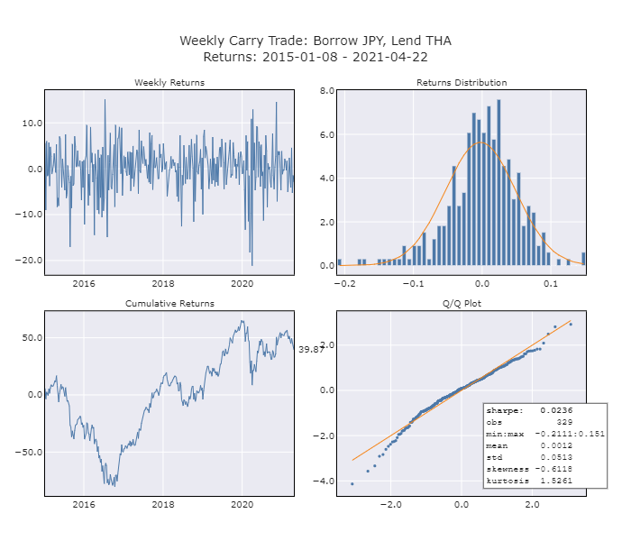

# FINM33150 - Carry Trade

## Dependencies

Create a virtual environment and install dependencies with

    pipenv install

## Summary
Here we analyze three different carry trade strategies involving cross-currency fixed-float and basis swaps. In each we borrow Japanese Yen at three-month Libor + 50bps and use 80% leverage to purchase 5-year government bonds in one of the following markets:
* Thailand
* Romania
* Indonesia

Our investment period spans from 2015-01-01 to 2021-04-22. We mark to market back to USD on a weekly basis.

## Results
* None of the strategies was good.
* The one involving the Thai Bhat was the best, producing a cumulative return of 39.9% over the period with a Sharpe ratio of just 0.0236.
* Profit was negatively impacted in all of the strategies early on by unfavorable fx rate movements.
* All of the strategies experienced catastrophic losses as a result of extreme jumps in yields at the onset of the pandemic. The strategy involving the Indonesian Rupiah lost over 40% in a single day.

## Returns

## Underlying Securities

